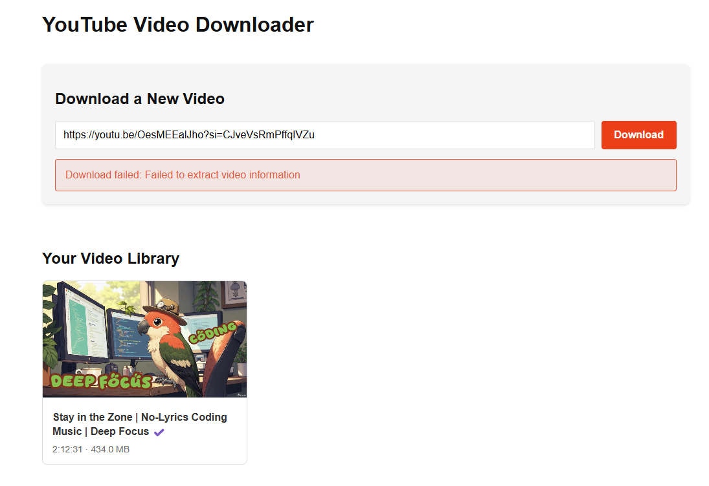
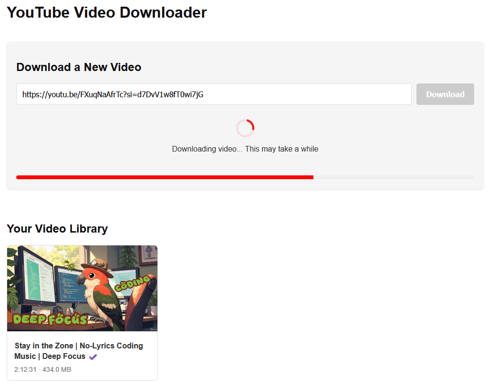
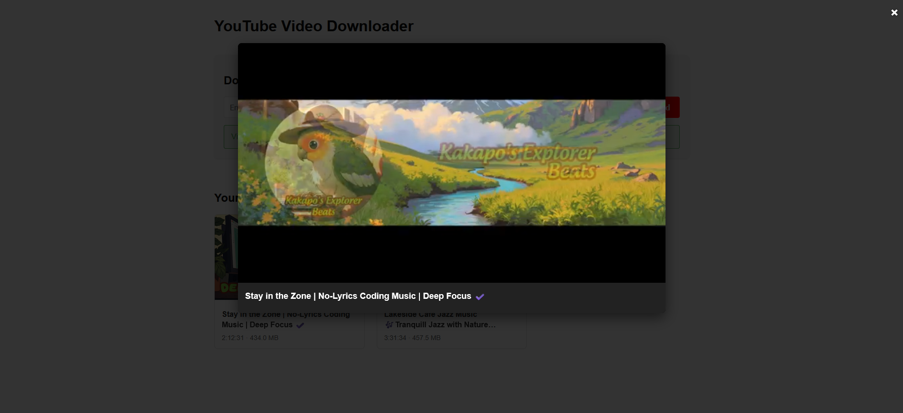
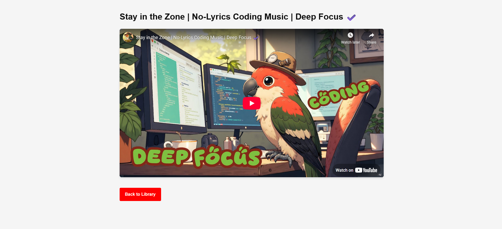
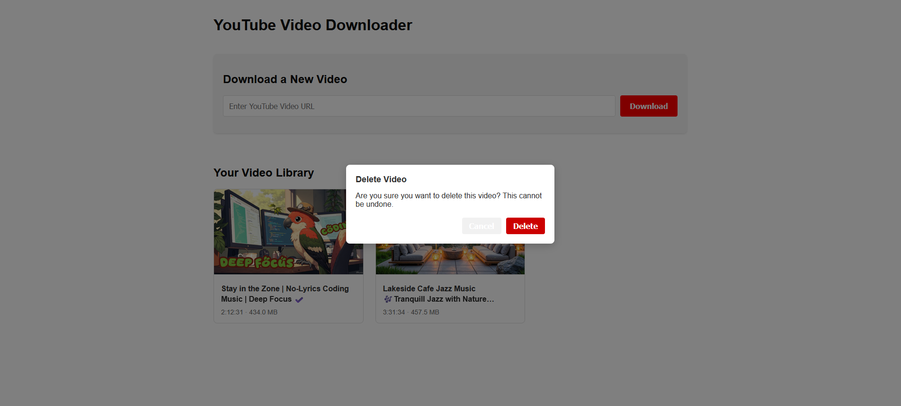
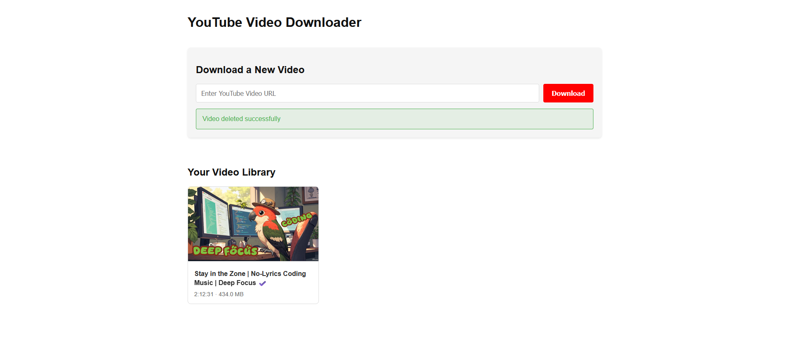
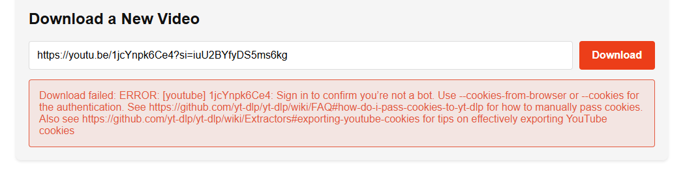
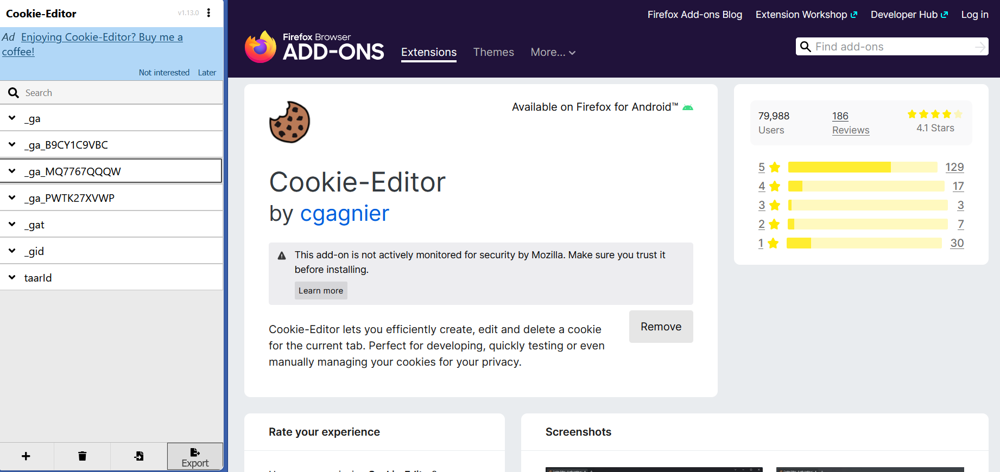
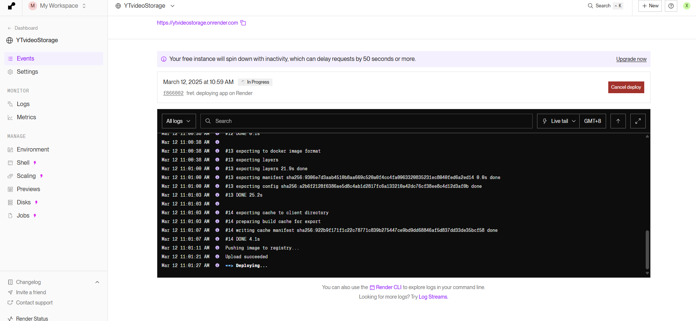

Certainly! Below is the restructured and reformatted content into a well-organized **README.md**:

```markdown
# YouTube Video Sharing Web App

This project is a web-based application that allows users to download YouTube videos and share them in real-time. The application runs on the Flask development server and provides a simple interface for users to interact with. 

The backend is built using Flask, and the frontend is designed with HTML and CSS. The app is deployed using Docker on Render, and Gunicorn is used as the WSGI server for production deployment.

---

## Link to Webpage hosted on Render

You can access the live application at: [YouTube Video Storage](https://ytvideostorage.onrender.com)  
**Note**: The features are not fully functional at the moment.  


---

## **YouTube Video Downloader** 🎥📥

This is a simple **web-based YouTube video downloader** built with **Flask (Python backend)** and **HTML, JavaScript (frontend)**. It allows users to enter a YouTube link and download the video in MP4 format.

  
  
  
  


---

### **📌 Features**  
- ✅ User-friendly web interface  
- ✅ Downloads YouTube videos in MP4 format  
- ✅ Supports resolutions up to **1080p**  
- ✅ Built using **Flask** and **yt-dlp**  
- ✅ Compresses to a zip file when needed, and allows users to unzip and open / connect to a remote server to save the videos (media saver).

---

## **🛠 Installation & Setup**  

### **1️⃣ Install Dependencies**  
Make sure you have **Python 3** installed. Then, install the required packages:
```bash
pip install flask yt-dlp
```

### **2️⃣ Run the Server**  
Start the Flask server:
```bash
python server.py
```

### **3️⃣ Open the Web App**  
- Open **index.html** in your browser **OR**  
- Go to **http://127.0.0.1:5000/**  

---

## **📜 Usage**  
1️⃣ Enter a **YouTube video link** in the input field.  
2️⃣ Click the **"Download"** button.  
3️⃣ The video will be downloaded to your local system.  

---

## **📁 Project Structure**  
```
/youtube-downloader
│── index.html        # Frontend (HTML + JS)
│── server.py         # Backend (Flask + yt-dlp)
│── README.md         # Documentation
│── /downloads        # (Optional) Folder for storing downloaded videos
```

---

## **💡 Troubleshooting**  

### **⚠️ "yt-dlp command not found" error**  
Run:
```bash
pip install --upgrade yt-dlp
```

### **⚠️ Video not downloading?**  
Ensure **ffmpeg** is installed (needed for merging audio & video).  

For **Windows**:
1. Download `ffmpeg.exe` from [ffmpeg.org](https://ffmpeg.org/download.html).
2. Add it to your system **PATH** environment variable.

For **macOS/Linux**:
```bash
brew install ffmpeg  # macOS
sudo apt install ffmpeg  # Ubuntu/Linux
```

---

## **📜 License**  
This project is **open-source** and free to use.

---

# YouTube Video Sharing Web App (Extended Details)

This is the second part of the project. In addition to the downloader, it provides the functionality of sharing YouTube videos in real-time.

---

## **Tech Stack**

- **Backend**: Flask (Python)
- **Frontend**: HTML, CSS
- **Deployment**: Render (Platform as a Service) - [Render Deployment Link](https://dashboard.render.com/web/srv-cv8fgvqn91rc738i4f30/deploys/dep-cv8kfldumphs73cpt090)
- **Containerization**: Docker
- **WSGI Server**: Gunicorn
- **Version Control**: Git
- **Cookies Handling**: Python (for reading YouTube cookies)

### Python Code for Cookie Extraction:
```python
import os
import subprocess
import json
from pathlib import Path

COOKIE_FILE = os.path.join(os.path.dirname(os.path.abspath(__file__)), 'youtube_cookies.txt')

def extract_cookies_from_chrome():
    """Extract YouTube cookies from Chrome browser via yt-dlp's browser cookie feature."""
    try:
        subprocess.run(
            ["yt-dlp", "--cookies-from-browser", "chrome", "-o", "temp", "--skip-download", "https://www.youtube.com"],
            check=True,
            capture_output=True
        )
        print("Browser cookies extracted successfully")
        return True
    except subprocess.CalledProcessError as e:
        print(f"Error extracting browser cookies: {e}")
        print(f"stdout: {e.stdout.decode()}")
        print(f"stderr: {e.stderr.decode()}")
        return False

def get_youtube_cookies_path():
    """Get path to YouTube cookies file or attempt to create one."""
    
    if os.path.exists(COOKIE_FILE):
        return COOKIE_FILE
    
    if extract_cookies_from_chrome():
        cookie_files = list(Path(".").glob("*.txt"))
        if cookie_files:
            os.rename(str(cookie_files[0]), COOKIE_FILE)
            print(f"Cookie file saved to {COOKIE_FILE}")
            return COOKIE_FILE
    
    print("Warning: Could not create cookie file. Some videos may be inaccessible.")
    return None
```

- **Database**: (Optional - can just run `server.py` directly without the need for Render services)

---

## **Steps to Set Up and Deploy**

### 1. Flask Backend Development

The backend is powered by Flask, a lightweight web framework for Python. The user interface is created using simple HTML and CSS, ensuring a responsive and clean design.

### 2. Docker for Containerization

The application is containerized using Docker to simplify deployment and scaling. Docker ensures consistency across environments and provides a reliable way to deploy the app on Render.

### 3. Gunicorn for WSGI

For production environments, the application is served using **Gunicorn**, which is a WSGI (Web Server Gateway Interface) HTTP server. It is used to handle HTTP requests to the Flask app.

### 4. Deployment on Render

Render is used to deploy the app on a cloud platform, which provides free hosting with containerized deployment and automatic scaling.

---

## **Issues and Solutions**

### Test 1: **Bad Bot - Need Sign In**



During the initial testing, I encountered a "Bad Bot" error while trying to download YouTube videos. This was due to YouTube requiring a sign-in to access certain videos. This issue was resolved after implementing cookie handling, which bypasses the need for a sign-in by reading YouTube cookies.

---

### Test 2: **File Cannot Read Format**



The issue was that the app could not properly read the format of the file, resulting in a failure to fetch the video. The solution was to install a **cookies extension** to save the YouTube cookies into a text file. This allowed the app to read the cookies file successfully, bypassing the sign-in process and enabling smooth video downloads.

---

### Test 3: **Cannot Run When Deployed to Render**

After deploying the app to Render, it failed to run properly. The issue was due to incorrect environment configurations. However, after making the necessary adjustments to the environment settings and ensuring the correct versions of dependencies were installed, the app was successfully deployed and is now accessible on Render.



---

## **How to Run Locally**

1. Clone the repository:
   ```bash
   git clone https://github.com/your-username/yt-video-sharing-app.git
   ```

2. Navigate to the project directory:
   ```bash
   cd yt-video-sharing-app
   ```

3. Install required dependencies:
   ```bash
   pip install -r requirements.txt
   ```

4. Set up YouTube cookies (optional for sign-in bypass):
   - Install the **cookies extension** and save the YouTube cookies as a text file.
   - Ensure the cookies file is accessible by the app.

5. Run the Flask development server:
   ```bash
   python server.py
   ```

6. Open your browser and go to `http://127.0.0.1:5000/` to access the app locally.

---

## **Acknowledgements**

- Flask documentation
- Gunicorn documentation
- Render platform
- Docker community
- Internet